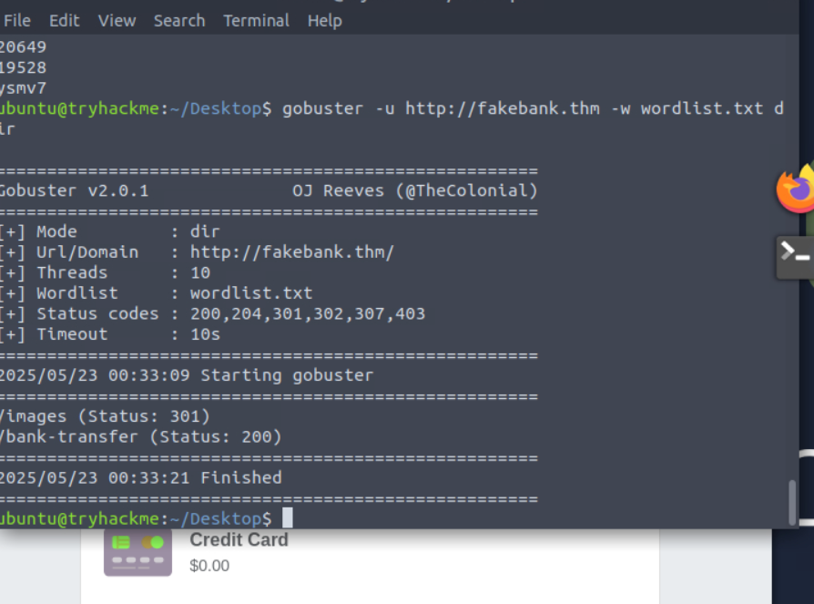
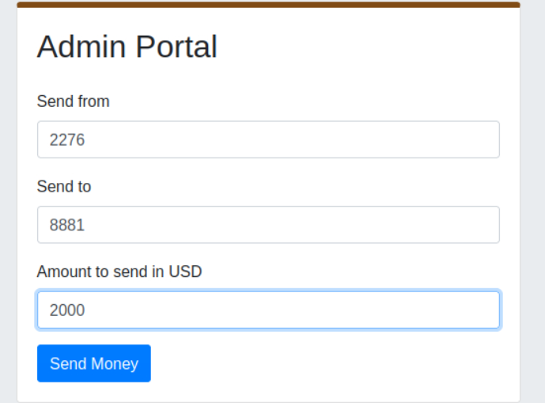

In the first section, I'll be using the tool **gobuster**. It'll brute force *URL, DNS subdomains, etc.*

So in the VM, I'm using the tool now.

**"gobuster -u [target url] -w [pathtowordlist] dir"**

So, I'm not too sure what dir means just yet.
It seems that a wordlist was already provided, that makes sense.

**-u is used to state the website being scanned**
**-w takes a list of words that it'll go through to find hidden pages**

7 "So, I'm not too sure what dir means just yet."
I'm assuming that whenever the command is ran through, it'll be scanning for directories.
That sounds kind of obvious.

I've accessed the secret bank transfer page found through the usage of gobuster.

I'm gonna transfer it to my own account. This is surely untracable and will have zero repercussions.

I've completed the offsec intro!!!